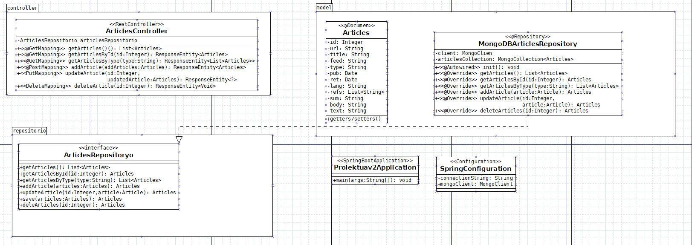

<h1> Datu-atzipeneko proiektua(Aritz Arruabarrena):</h1>

Proiektuaren helburu nagusia Mongo datu-base bateko datuak atzitzeko Rest API bat garatzea izango da, Spring Java teknologia erabiliz.
JSON-a ez du uzten igotzen pisu gehiegi duelako

<h2>Datuak:</h2>

Datuak erabiltzerako orduan, minimo batzuk genituen betebehar zirenak, eskatzen zena zen json edo csv artxibo bat izatea, 500 erregistro baino gehiago izan behar zuen eta erregistro horietan zegoen informazioetako eremu bat, array-a edo objetu motakoa izan behar zen.

Datuak bilatzerako orduan, <u src="https://www.kaggle.com/">Kaggle-ko </u> horrialdea erabili dut, horrialde horretan informazio asko dago eta gainera informazio interesgarria. 
Nire proiekturako artikuluen inguruko json bat hartu dut, hainbat periodietako artikuluak kontuan hartuta, horietako eremu bat array-a da eta 60 mila registro ditu, orduan ezkatzen duena betetzen du. Datu honekin lanean ibiltzeko, esan beharrekoa da artikulu guztiak ingelezez daudela. <u src="https://www.mongodb.com/products/tools/compass" >MongoDB Compass</u>

<h2>Rest zerbitzua</h2>

Mongo Driver Sync liburutegia erabiliko da Mongo datuak atzitzeko eta gutxienez endpoint bat prestatu behar da mota bakoitzetik (GET, POST, PUT, DELETE). Swagger - Open Api Documentation bidez argitaratuko da API, beraz, lau koloreak ikusi behar dira

Hemengo argazki honetan ikusi dezakegu nola GET,PUT,POST eta DELETE endopintak dauden ezkatzen zen bezala.

<h3> GET </h3>

<b>/api/articles </b> get mota horrek ez du artikulu guztiak bilatzen baizik eta azken argitalatutako artikuluak dira eta 100 bakarrik agertzen dira, bestela ez zen web orria kargatzen edo jausi egiten zen eta horrela ikusi dezakegu datuak

<b>/api/articles/{id}</b> hemengo honetan artikulu guztia bilatu ahal dira, id-a ipiniz gero, horrela forma ordenatu batean egin daitezke bilaketak.

<b>/api/articles/{type}</b>
artikulu asko daudenez gaia ere badago eta orduan get horrekin, nahi duzun gaia aurkitu dezakezu eta horrela id-a ez badakizu ahal duzu gaiarekin bilatu.

<h3> POST </h3>

post metodo honek, gehitu dezake artikulu berriak, eta zuk nahi duzun artikulua sortu dezakezu

<h3> PUT </h3>
put honek artikuluak aldatu edo modifikatu ditzake, gaizki sartu ezkero daturen bat, honekin aldaketak egin ahal dira

<h3> DELETE </h3>

Delete, izenak esaten duen bezela zuk nahi duzun erregistroa kendu dezakezu, ez bazaizu guztatzen id-a sartu ezkero kendu dezakezu.

<h2>Java proiektua(k)</h2>

Goiko argazkian ikusten dena da, pixka bat nola antolatuta dagoen klase diagrama eta guztiak, bere klasearekin eta atributoekin. Martxan jartzeko aplikazioa, bakarrikan <i>Proiektuakv2Aplication.java</i> artxibora joan behar da eta martxan jarri eta hori egin eta gero zuk nahi duzun nabigatzailea ireki eta url hau jarri <u>http://localhost:8080/swagger-ui/index.html</u>, hori egin ondoren ikusi dezakezu endPoint guztiak.

Diagrama hobetuago ikusi nahi ezkero dia karpetan dago artxiboa.
